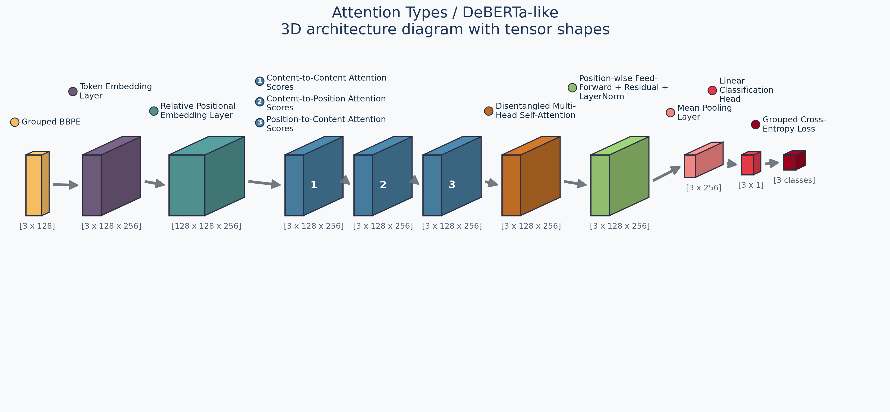
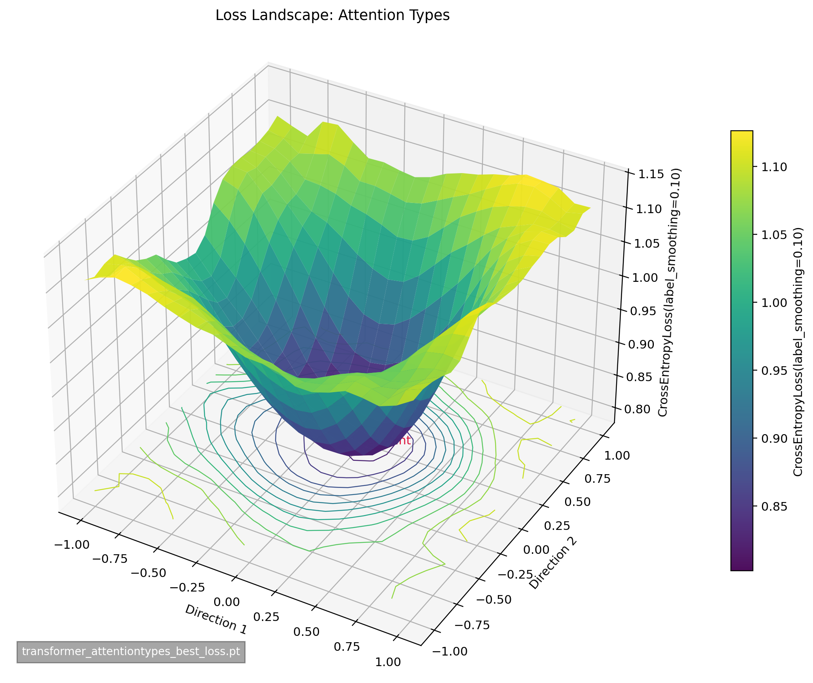
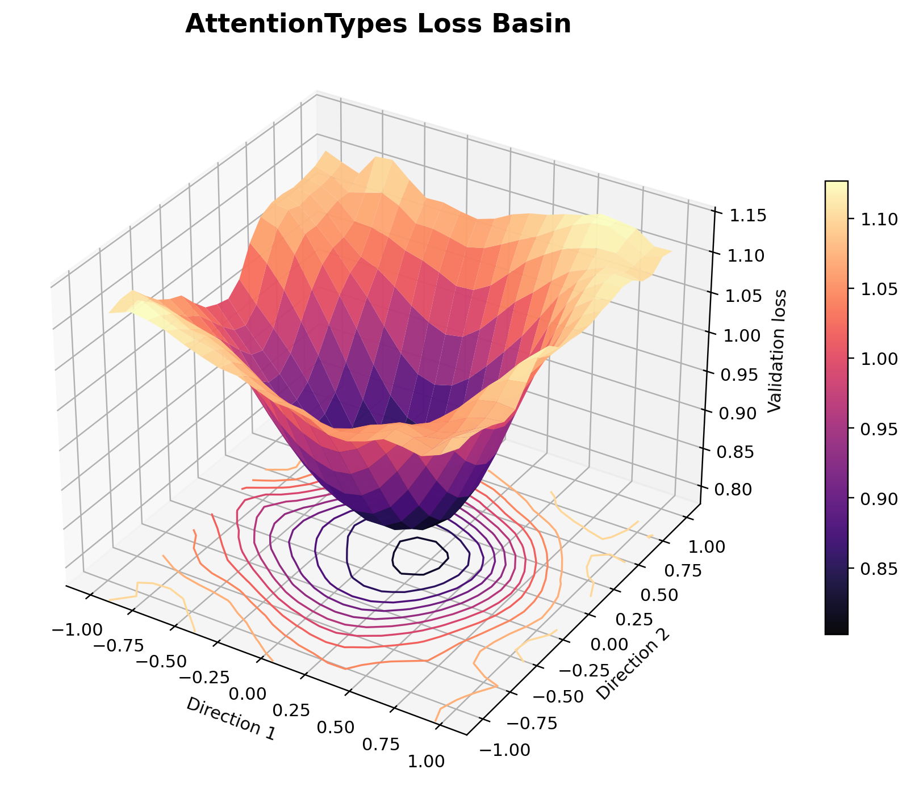
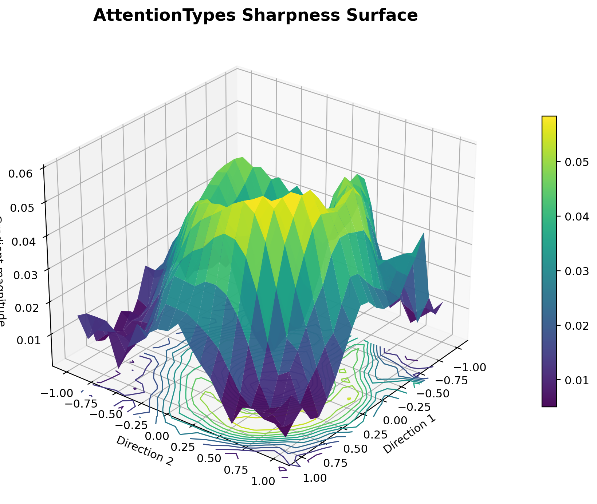
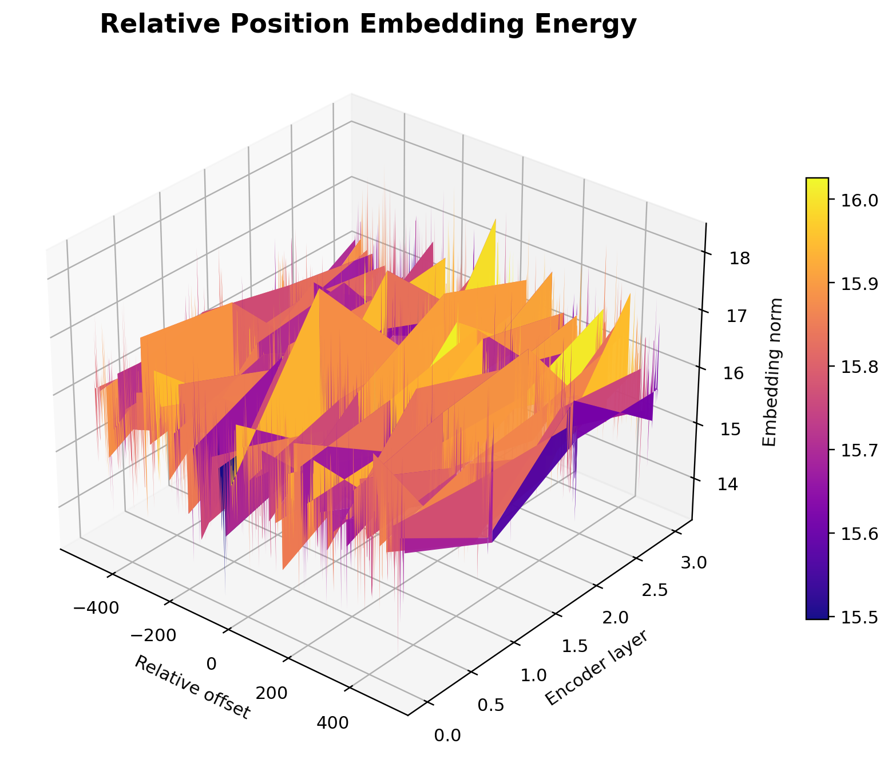
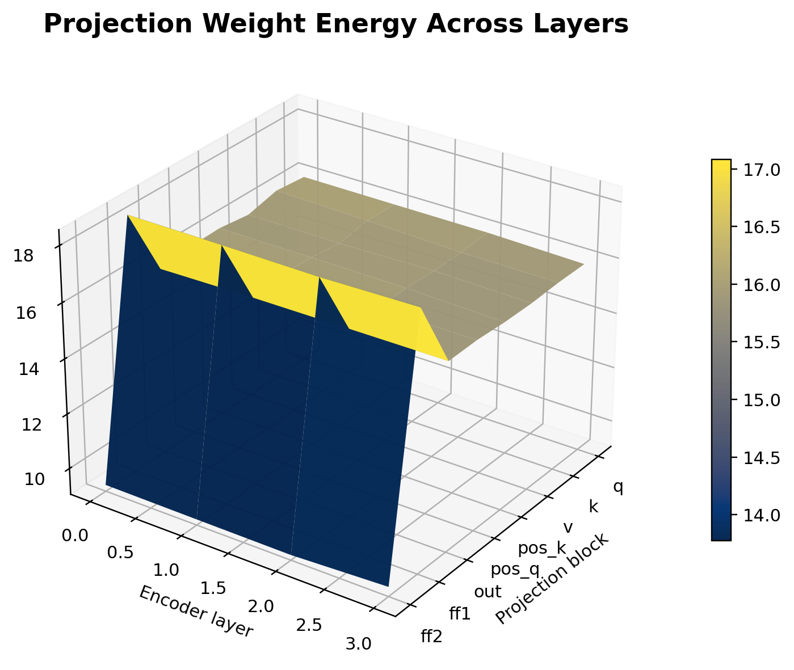
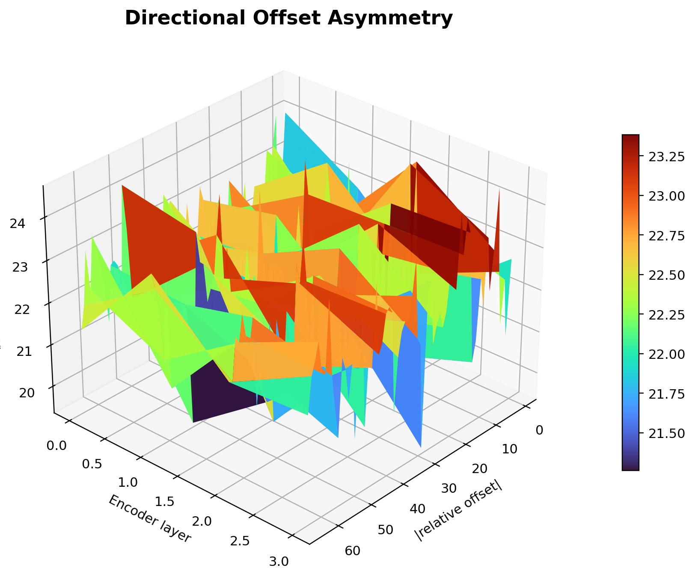
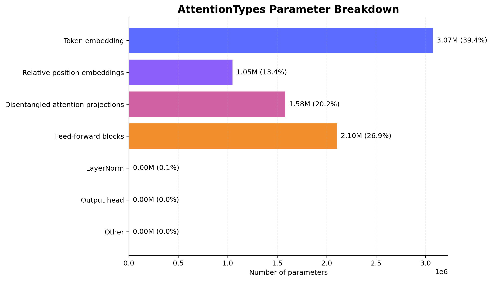
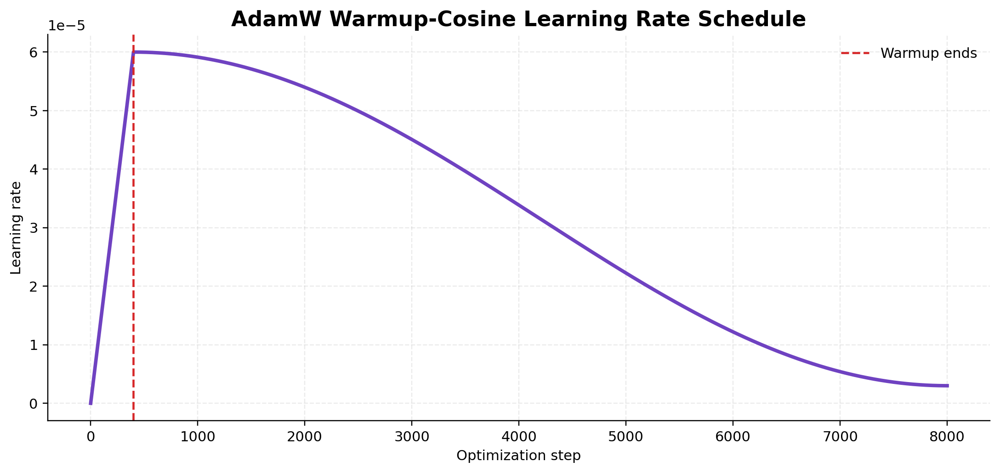

# Commonsense Reasoning with Neural Networks

Course project for a Kaggle-style commonsense reasoning challenge. The task is to select the correct answer (`A`, `B`, or `C`) for a false sentence by comparing candidate options and training neural models to recover the sensible statement.

This repository contains baseline models, transformer-based experiments, custom tokenization, evaluation scripts, saved checkpoints, and analysis/visualization outputs. The main model explored here is a grouped BBPE transformer with DeBERTa-inspired disentangled attention.

## Example Task

One question in this challenge has the following form:

**False sentence:** `The sun rises in the west.`

**Candidate answers:**

- `A`: `The sun rises in the east.`
- `B`: `The sun sets in the west.`
- `C`: `The sun shines at night.`

The correct answer is `A`. The model must learn which candidate best repairs the false statement.

## Highlights

- Multiple baselines and transformer variants for commonsense reasoning
- Grouped BBPE input formulation for multiple-choice scoring
- DeBERTa-inspired attention-type experiments
- Training diagnostics, architecture plots, and analysis figures included

## Result

The strongest final experiment in this repo is the grouped BBPE `AttentionTypes` model. It reached a best validation accuracy of `0.7456` and a final Kaggle public score of `0.7350`.

Hugging Face model: `https://huggingface.co/owenarink/attentiontypes-commonsense`

## Competition-Style Summary

- Input: one false sentence with three candidate corrections
- Representation: grouped BBPE tokenization
- Model: shared transformer encoder with disentangled attention
- Pooling: mean pooling over valid tokens
- Optimizer: AdamW with warmup + cosine decay
- Output: one score per option, then `argmax` over `A/B/C`

## BBPE, TF-IDF, And Baselines

**BBPE tokenization**

Byte-Pair Encoding builds subword units by repeatedly merging frequent symbol pairs:

$$
(a,b)^\star = \arg\max_{(a,b)} \mathrm{freq}(a,b)
$$

After learning merges, a text sequence is represented as subword tokens:

$$
x = [t_1, t_2, \dots, t_L]
$$

Simple example:

$$
\texttt{sunrise} \rightarrow [\texttt{sun}, \texttt{rise}]
$$

In this project, each grouped input looks like:

$$
[\texttt{<cls>}, \texttt{false sentence}, \texttt{<sep>}, \texttt{candidate option}, \texttt{<eos>}]
$$

**TF-IDF**

For the MLP baseline, each document is converted into a weighted sparse vector:

$$
\mathrm{tfidf}(t,d) = \mathrm{tf}(t,d)\cdot \log \frac{N}{\mathrm{df}(t)}
$$

Short example:

$$
\texttt{``sun rises east''} \mapsto
[\,w_{\texttt{sun}},\, w_{\texttt{rises}},\, w_{\texttt{east}}, \dots]
$$

Rare, informative terms get larger weights than common terms.

**MLP baseline**

The TF-IDF baseline applies stacked affine layers with ReLU:

$$
h_1 = \mathrm{ReLU}(W_1 x + b_1), \qquad
\hat{y} = W_2 h_1 + b_2
$$

**Pairwise MLP**

For pairwise scoring, each option is scored independently:

$$
s_k = f_{\mathrm{MLP}}(x_k), \qquad \hat{y} = \arg\max_k s_k
$$

where `x_k` is the TF-IDF vector for `(false sentence [SEP] option_k)`.

**Pairwise CNN**

The text CNN first embeds tokens, applies 1D convolutions and residual blocks, then pools the sequence into one vector:

$$
E = \mathrm{Embed}(x_{1:L})
$$

$$
H^{(1)} = \mathrm{Conv1D}(E), \qquad
H^{(\ell+1)} = \mathrm{ResBlock}(H^{(\ell)})
$$

$$
h = \mathrm{MaxPool}(H^{(L_{\mathrm{cnn}})})
$$

$$
s_k = W h_k + b, \qquad \hat{y} = \arg\max_k s_k
$$

Like the pairwise MLP, the CNN scores each `(false sentence, option)` pair separately and selects the highest-scoring option.

## Model explanation

For each question, the model scores the three candidate options and predicts the highest-scoring answer:

$$
\hat{y} = \arg\max_{k \in \{A,B,C\}} s_k
$$

Each option is passed through the same encoder and linear score head:

$$
h_k = \mathrm{Encoder}(x_k), \qquad s_k = W h_k + b
$$

The grouped training objective is cross-entropy over the three option scores:

$$
\mathcal{L}_{\mathrm{CE}} = - \log \frac{\exp(s_y)}{\sum_{k=1}^{3} \exp(s_k)}
$$

The simplified DeBERTa-style attention in this project mixes three score terms:

$$
\mathrm{score}_{ij} = q_i^\top k_j + q_i^\top r_{ij}^{(K)} + r_{ij}^{(Q)\top} k_j
$$

and the final attention weights are

$$
\alpha_{ij} = \mathrm{softmax}\left(\frac{\mathrm{score}_{ij}}{\sqrt{d_k \cdot 3}}\right)
$$

Relative position embeddings encode token distance rather than absolute position:

$$
r_{ij} = \mathrm{Embed}\big(\mathrm{clip}(j-i,\,-M,\,M)\big)
$$

Mean pooling averages only over non-padding tokens:

$$
h = \frac{\sum_{t=1}^{L} m_t x_t}{\sum_{t=1}^{L} m_t}
$$

where `m_t = 1` for real tokens and `0` for padding.

Dropout is used as regularization during training:

$$
\tilde{h} = \frac{m \odot h}{1-p}, \qquad m \sim \mathrm{Bernoulli}(1-p)
$$

The optimizer is AdamW, which combines adaptive moments with decoupled weight decay:

$$
\theta_{t+1} = \theta_t - \eta \frac{\hat{m}_t}{\sqrt{\hat{v}_t} + \epsilon} - \eta \lambda \theta_t
$$

## Regular Transformer With BBPE

The non-DeBERTa transformer baseline uses standard token embedding, absolute positional encoding, self-attention, and mean pooling:

$$
e_t = \mathrm{Embed}(x_t) + p_t
$$

$$
\mathrm{Attention}(Q,K,V) = \mathrm{softmax}\left(\frac{QK^\top}{\sqrt{d_k}}\right)V
$$

$$
h = \mathrm{MeanPool}(\mathrm{Transformer}(e_{1:L}))
$$

$$
s_k = W h_k + b, \qquad \hat{y} = \arg\max_k s_k
$$

## Other DeBERTa-Style Variants Tried

I also tried a few lighter and heavier relative-position attention variants around the main `AttentionTypes` model.

**1. RelativeSimple**

This removes the position-to-content term and keeps only content-to-content plus content-to-position:

$$
\mathrm{score}_{ij}^{\mathrm{relsimple}} = q_i^\top k_j + q_i^\top r_{ij}^{(K)}
$$

This is simpler than full disentangled attention and tests whether relative keys alone are enough.

**2. SepDistance**

This adds an extra term based on distance from the separator token between the false sentence and candidate answer:

$$
\mathrm{score}_{ij}^{\mathrm{sepdist}} =
q_i^\top k_j + q_i^\top r_{ij}^{(K)} + r_{ij}^{(Q)\top} k_j + q_i^\top s_j
$$

where `s_j` is an embedding of the token's distance to the `[SEP]` boundary. The idea is to tell the model more explicitly whether a token belongs near the false sentence side or the candidate-answer side.

**3. AttentionTypes**

This is the full variant used for the main result:

$$
\mathrm{score}_{ij}^{\mathrm{attn-types}} = q_i^\top k_j + q_i^\top r_{ij}^{(K)} + r_{ij}^{(Q)\top} k_j
$$

This turned out to be the strongest and most stable of the DeBERTa-inspired attention variants in the repository.

## Counterfactual Variants

**BERT Counterfactual Repair**

This model tries to localize the anomalous part of the false sentence and connect it to a repair in the candidate option:

$$
a_i = \mathrm{softmax}(w_a^\top x_i), \qquad i \in \text{false sentence}
$$

$$
r_i = \sum_{j \in \text{option}} \alpha_{ij}^{\mathrm{repair}} x_j
$$

$$
u_i = \sum_{j \in \text{option}} \alpha_{ij}^{\mathrm{support}} x_j
$$

$$
z = \mathrm{Fuse}\left(\sum_i a_i x_i,\; \sum_i a_i r_i,\; \sum_i a_i u_i\right)
$$

**BERT Counterfactual Cross-Option**

This variant lets the option summaries compete directly across the three candidates:

$$
o_k = \mathrm{RepairBlock}(x_k)
$$

$$
\beta_k = \mathrm{softmax}(w_c^\top o_k)
$$

$$
\tilde{o}_k = o_k - \sum_{m \neq k} \beta_m o_m
$$

The goal is to highlight which candidate is strongest relative to the alternatives, not just in isolation.

**BERT Counterfactual Latent Edit Competition**

This model infers a shared latent correction vector for the false sentence:

$$
\delta = \tanh(W_\delta h_{\mathrm{false}})
$$

$$
\tilde{h}_{\mathrm{false}} = h_{\mathrm{false}} + \delta
$$

$$
g_k = \langle W_q \tilde{h}_{\mathrm{false}},\, W_k h_{\mathrm{option},k}\rangle - \lambda \|\delta\|_2^2
$$

The edit vector is shared, while each option competes to explain the repaired false-side representation.

## Selected Figures

**AttentionTypes model architecture**



**3D loss diagnostics**

<table>
  <tr>
    <td></td>
    <td></td>
    <td></td>
  </tr>
  <tr>
    <td align="center">Original loss landscape</td>
    <td align="center">Basin view around the minimum</td>
    <td align="center">Gradient-magnitude surface</td>
  </tr>
</table>

**3D model geometry**

<table>
  <tr>
    <td></td>
    <td></td>
  </tr>
  <tr>
    <td align="center">Learned relative-position embedding energy across layers</td>
    <td align="center">Projection-weight energy across attention and FFN blocks</td>
  </tr>
</table>

**3D directional bias**

<table>
  <tr>
    <td></td>
  </tr>
  <tr>
    <td align="center">How strongly the model distinguishes tokens before vs after a reference position</td>
  </tr>
</table>

**Optimization diagnostics**

<table>
  <tr>
    <td></td>
    <td></td>
  </tr>
  <tr>
    <td align="center">Where model capacity is allocated</td>
    <td align="center">AdamW warmup-cosine schedule</td>
  </tr>
</table>

## How The Model Works

- The model reads each `(false sentence, option)` pair separately, but uses the same encoder for all three options.
- DeBERTa-style attention helps the model keep apart two things: what the token means and where it is relative to another token.
- Relative position embeddings tell the model whether another token is nearby, far away, before, or after the current token.
- Mean pooling turns the full token sequence into one vector by averaging the valid token representations.
- The final linear layer converts that pooled vector into one score per answer option.

## Hyperparameters

The main `attentiontypes` experiment uses:

- `model_dim = 256`
- `num_heads = 8`
- `num_layers = 4`
- `ff_mult = 4`
- `dropout = 0.30`
- `grouped_max_len = 128`
- `optimizer = AdamW`
- `learning_rate = 6e-5`
- `weight_decay = 5e-2`
- `label_smoothing = 0.10`
- `batch_size = 32`
- `warmup = 5% of scheduled steps`
- `scheduler = cosine decay`

## Validation Results

The table below summarizes the archived validation scores from the saved comparison figure and training logs in this repository.

| Model | Validation accuracy |
| --- | ---: |
| MLP + TF-IDF | 0.3338 |
| Pairwise MLP | 0.7100 |
| Pairwise CNN | 0.6694 |
| Transformer BBPE | 0.7300 |
| AttentionTypes | 0.7456 |
| Counterfactual Repair | 0.7400 |
| Cross-Option Attention | 0.7344 |
| Latent Edit Competition | 0.7125 |

For the final competition submission, the `AttentionTypes` model achieved a Kaggle public score of `0.7350`.

## Repository Structure

- `src/`: training, evaluation, preprocessing, models, and analysis code
- `data/`: training/test data and sample submission files
- `checkpoints/`: saved model weights and tokenizer metadata
- `outputs/`: generated plots and architecture visualizations
- `docs/`: supporting notes

## Getting Started

Clone the repository and install the Python dependencies used in the project environment. Then run one of the training scripts from `src/`, for example:

```bash
python -m src.train_model_transformer_attentiontypes
```

Other entry points include:

```bash
python -m src.run_baselines
python -m src.train_model_transformer
python -m src.eval
```

To regenerate the README figures added in this page:

```bash
python -m src.analysis.generate_readme_figures
```

## Notes

- Some scripts were written for local course experimentation and may assume existing checkpoints or prepared tokenizers
- The repository includes generated outputs and trained artifacts for reproducibility and project presentation

## Authors

- Owen Arink
- T. Santos Andersen
