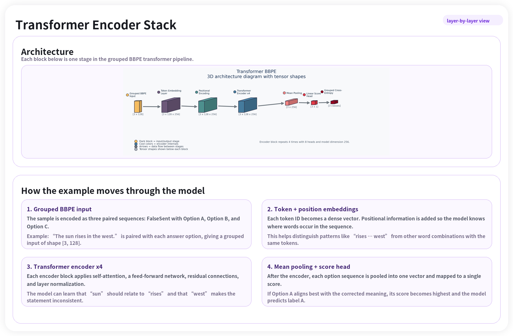
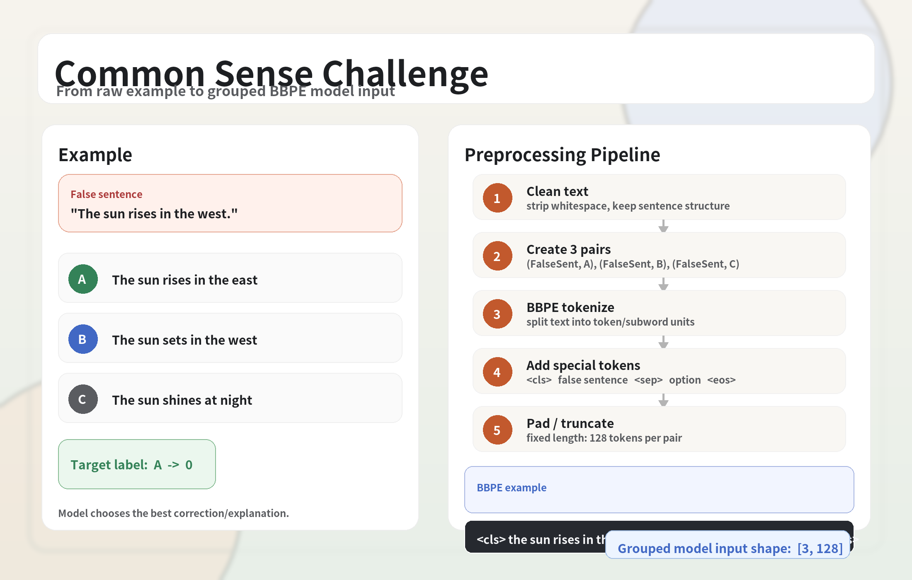
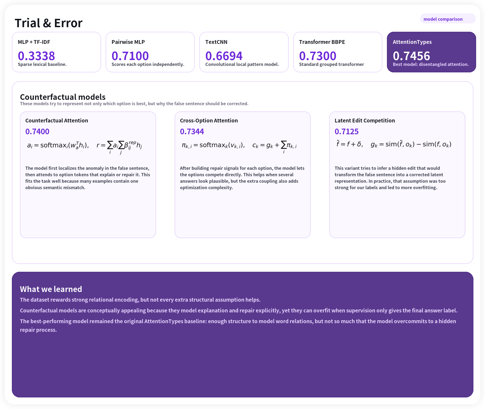

# Commonsense Reasoning with Neural Networks

Course project for a Kaggle-style commonsense reasoning challenge. The task is to select the correct answer (`A`, `B`, or `C`) for a false sentence by comparing candidate options and training neural models to recover the sensible statement.

This repository contains baseline models, transformer-based experiments, custom tokenization, evaluation scripts, saved checkpoints, and analysis/visualization outputs used for the project and poster.

## Highlights

- Multiple baselines and transformer variants for commonsense reasoning
- Grouped BBPE input formulation for multiple-choice scoring
- DeBERTa-inspired attention-type experiments
- Training diagnostics, architecture plots, and analysis figures included

## Result

The strongest final experiment in this repo is a grouped BBPE transformer with DeBERTa-like attention-type mechanisms, which achieved a Kaggle public score of about `0.7456`.

## Approach

The core setup converts each question into three `(false sentence, candidate answer)` pairs, tokenizes them with BBPE, and scores the options with a shared encoder. Beyond baseline MLP/CNN models, the main focus of the project is transformer-based modeling and attention mechanism variants for better commonsense reasoning.

## Core Equations

For each question, the model scores the three candidate options and predicts the highest-scoring answer:

$$
\hat{y} = \arg\max_{k \in \{A,B,C\}} s_k
$$

where each option score is produced from a shared encoder:

$$
h_k = \mathrm{Encoder}(x_k), \qquad s_k = W h_k + b
$$

The training objective is standard cross-entropy over the option scores:

$$
\mathcal{L}_{\mathrm{CE}} = - \log \frac{\exp(s_y)}{\sum_{k=1}^{3} \exp(s_k)}
$$

The transformer attention mechanism is based on scaled dot-product attention:

$$
\mathrm{Attention}(Q, K, V) = \mathrm{softmax}\left(\frac{QK^\top}{\sqrt{d_k}}\right)V
$$

In the DeBERTa-inspired experiments, attention is extended with relative position information to better disentangle content and position signals.

## Selected Figures

**Model overview**



**Preprocessing pipeline**



**Model comparison**



**Loss landscape**


## Project Focus

- Build and compare neural approaches for sentence-level commonsense reasoning
- Experiment with grouped input modeling for multiple-choice prediction
- Explore DeBERTa-inspired attention-type variants and BBPE tokenization
- Analyze model behavior with plots, architecture diagrams, and explainability scripts

## Repository Structure

- `src/`: training, evaluation, preprocessing, models, and analysis code
- `data/`: training/test data and sample submission files
- `checkpoints/`: saved model weights and tokenizer metadata
- `outputs/`: generated plots and architecture visualizations
- `docs/`: supporting notes

## Getting Started

Clone the repository and install the Python dependencies used in the project environment. Then run one of the training scripts from `src/`, for example:

```bash
python -m src.train_model_transformer_attentiontypes
```

Other entry points include:

```bash
python -m src.run_baselines
python -m src.train_model_transformer
python -m src.eval
```

## Notes

- Some scripts were written for local course experimentation and may assume existing checkpoints or prepared tokenizers
- The repository includes generated outputs and trained artifacts for reproducibility and project presentation

## Authors

- Owen Arink
- T. Santos Andersen
